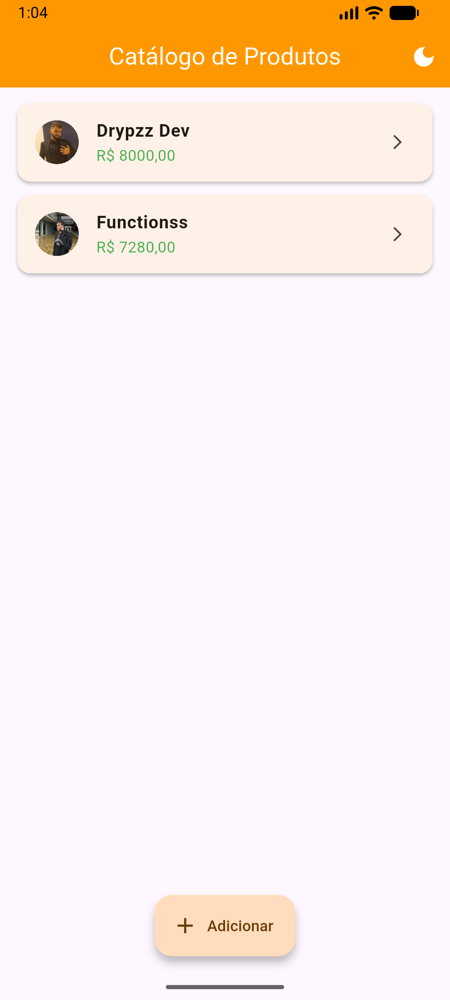
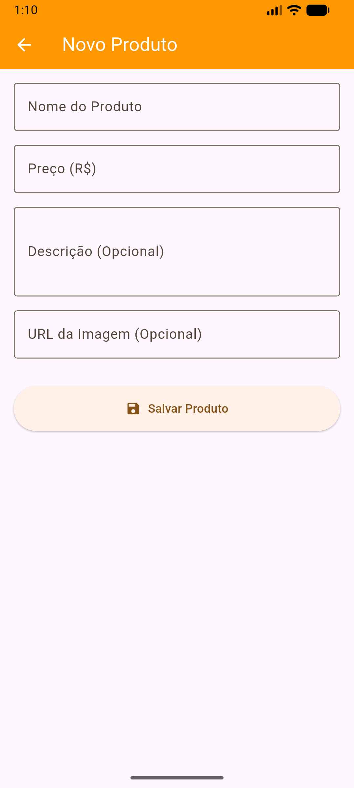
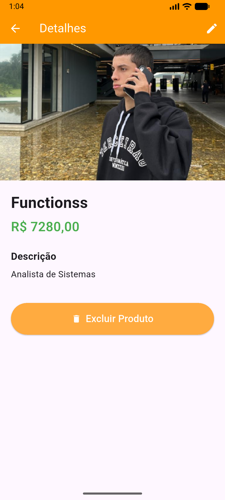
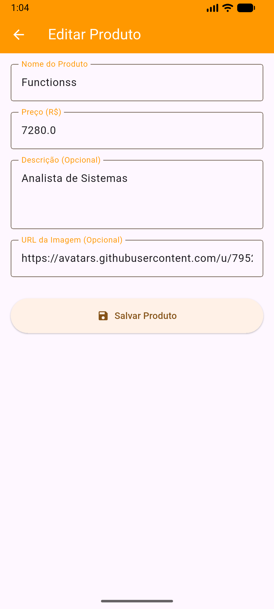
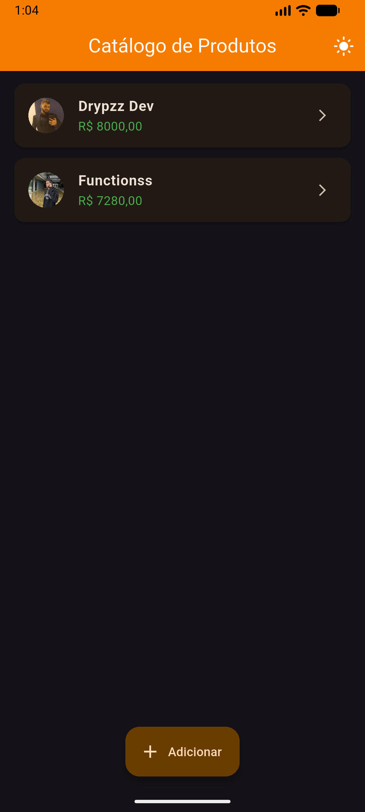
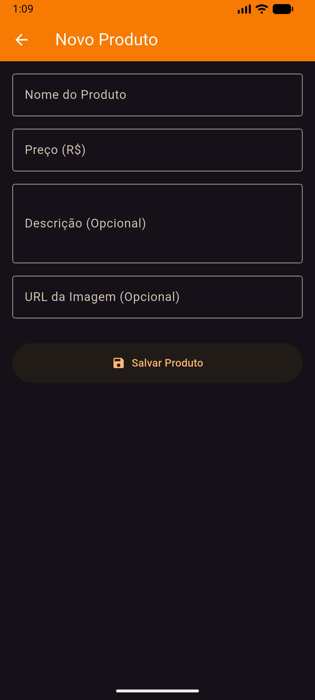
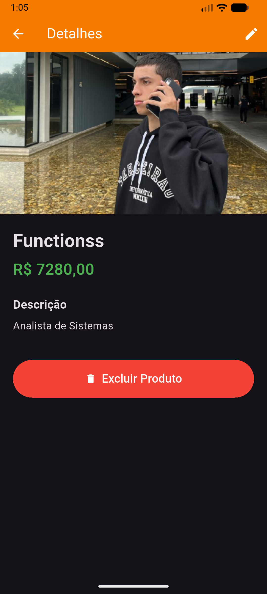
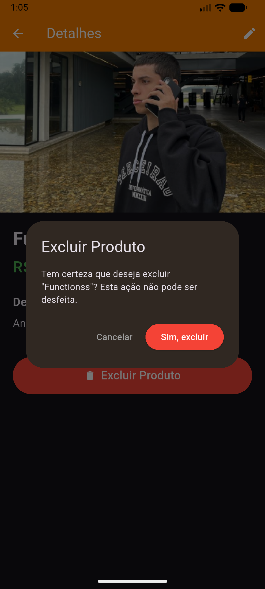

# App de Cadastro de Produtos 🛒

**Faculdade Senac Joinville**  
**Curso:** Análise e Desenvolvimento de Sistemas - 5ª Fase (2026/1)  
**Disciplina:** Desenvolvimento para Dispositivos Móveis  
**Aluno:** Lincoln Novais Mezzalira

## 📋 Sobre o Projeto
Aplicativo de cadastro e listagem de produtos desenvolvido como Atividade Prática da Aula 8. O objetivo do projeto é demonstrar o domínio sobre o sistema de navegação do Flutter (Navigator), envio e retorno de dados assíncronos entre múltiplas telas e a estruturação profissional do código-fonte.

## 🔄 Fluxo de Navegação
1. **Lista → Cadastro:** Ao clicar no botão `+` (`FAB`), o `Navigator.pushNamed('/cadastro')` é chamado. O App aguarda (`await`) o retorno.
2. **Cadastro → Lista:** Ao salvar, ocorre um `Navigator.pop(context, produto)`. A tela de lista recebe o objeto preenchido e atualiza o estado.
3. **Lista → Detalhes:** Ao clicar em um card, a rota `/detalhes` é ativada passando o objeto Produto como argumento (`settings.arguments`). A tela de Detalhes recebe e exibe a interface rica.
4. **Detalhes → Edição/Exclusão:** Botões de ação na AppBar de Detalhes retornam flags (ex: `'deletar'`) ou o produto editado via `Navigator.pop` para a tela principal atualizar a lista.

## ✨ Bônus Implementados (+10%)
* Utilização de **Rotas Nomeadas** (`onGenerateRoute`) no lugar de navegação imperativa clássica.
* Adição de campo para **URL de Imagem** com renderização de fallback caso esteja vazio.
* Botão para **deletar** o produto direto da tela de detalhes.
* Fluxo de **edição de produto existente**, reutilizando o formulário.
* Função manual de **formatação de preço** (R$ 0,00).
* **Animação Hero** para transição visual fluida da imagem entre a lista e os detalhes.

## 🖼️ Screenshots
### ☀️ Modo Claro
| Lista de Produtos | Cadastro de Produto | Detalhes do Produto | Editar Produto |
| :---: | :---: | :---: | :---: |
|  |  |  |  |

### 🌙 Modo Escuro & Alertas
| Lista de Produtos | Cadastro de Produto | Detalhes do Produto | Alerta de Exclusão |
| :---: | :---: | :---: | :---: |
|  |  |  |  |

## 🚀 Como Executar
1. Clone este repositório:
```bash
git clone [https://github.com/function404/app-produtos-flutter-lincoln.git](https://github.com/function404/app-produtos-flutter-lincoln.git)
```
2. Acesse o diretório do projeto e atualize os pacotes:
```bash
flutter pub get
```
3. Execute no seu emulador ou dispositivo físico:
```bash
flutter run
```